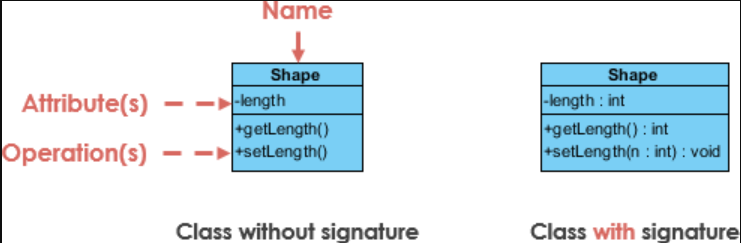

<h1 align="center">
  
</h1>

# Tema da Aula

Turma Online 21 - Imersão JavaScript | Semana 4 | 2022 | Professora Jéssica Osko

### Instruções
Antes de começar, vamos organizar nosso setup.
* Fork esse repositório 
* Clone o fork na sua máquina (Para isso basta abrir o seu terminal e digitar `git clone url-do-seu-repositorio-forkado`)
* Entre na pasta do seu repositório (Para isso basta abrir o seu terminal e digitar `cd nome-do-seu-repositorio-forkado`)
* [Add outras intrucoes caso necessario]

### Objetivo

Apresentar novos conceitos dos quatro pilares do paradigma orientado a objetos, focando em exemplos de aplicações reais, compartilhando padronizações e comportamentos na Linguagem de Programação Javascript. 

### Resumo
O que veremos na aula de hoje?
- [Tema da Aula](#tema-da-aula)
    - [Instruções](#instruções)
    - [Objetivo](#objetivo)
    - [Resumo](#resumo)
- [Pilares do Paradigma Orientado a Objetos](#pilares-do-paradigma-orientado-a-objetos)
  - [4 Pilares](#4-pilares)
      - [O que são e para que servem](#o-que-são-e-para-que-servem)
      - [Herança](#herança)
      - [Encapsulamento](#encapsulamento)
      - [Abstração](#abstração)
      - [Diagrama de Uso](#diagrama-de-uso)
      - [Encapsulamento x Abstração](#encapsulamento-x-abstração)
      - [Polimorfismo](#polimorfismo)
      - [**Tipos de polimorfismo:**](#tipos-de-polimorfismo)
    - [Exercícios](#exercícios)
    - [Material da aula](#material-da-aula)
    - [Links Úteis](#links-úteis)

- [Modificadores de acesso](#conteúdo)

  - [Exemplo](#exemplo)
    - [O que são e para que servem ](#o-que-são-e-para-que-servem)
    - [Benefícios](#benefícios)
    - [Abordagens](#abordagens)
    - [Implementação](#implementação)
  
  - [Exercícios](#exercícios)
  - [Material da aula](#material-da-aula)
  - [Links Úteis](#links-úteis)

# Pilares do Paradigma Orientado a Objetos

## 4 Pilares  
  #### O que são e para que servem
 
* Herança: classes filhas herdam dados e comportamentos da classe mãe;
* Encapsulamento: contém informações em um objeto, expondo apenas as informações selecionadas;
* Abstração: apenas expondo métodos públicos de alto nível para acessar um objeto;
* Polimorfismo: muitos métodos podem fazer a mesma tarefa; 

  #### Herança
A herança permite que as classes herdem características de outras classes.
As classes mãe estendem atributos e comportamentos para classes filhas.
A herança suporta a reutilização. 

Os benefícios da herança são que os programas podem criar uma classe mãe genérica e,
em seguida, criar classes filhas mais específicas, conforme necessário.
Isso simplifica a programação geral, porque em vez de recriar a estrutura da Userclasse várias vezes, as classes filhas obtêm acesso automaticamente às funcionalidades de sua classe pai.

  #### Encapsulamento
 
O encapsulamento é um dos fundamentos da programação orientada a objetos.
Refere-se ao agrupamento de dados com os métodos que operam nesses dados.
O encapsulamento é usado para ocultar os valores ou o estado de um objeto de dados
estruturados dentro de uma classe, a fim de impedir que partes não autorizadas tenham acesso
direto a eles.

Esse conceito também é frequentemente usado para ocultar a representação interna,
ou estado, de um objeto do lado de fora.
A ideia geral por trás desse mecanismo é simples.
Se você tiver um atributo que não é visível do lado de fora de um objeto e agrupá-lo com
métodos que fornecem acesso de leitura ou gravação a ele,
poderá ocultar informações específicas e controlar o acesso ao estado interno do objeto.

No encapsulamento, o objetivo é ocultar o máximo possível de implementação,
colocando-os todos em um único objeto e, em seguida, exibindo uma interface mínima.
A interface exibida pode então ser usada sem a necessidade de saber como foi implementada.
Em essência, você sabe que a interface resolve um problema específico ou executa um problema específico,
mas não precisa conhecer os detalhes de como ela o resolve.

Existem diferentes tipos de métodos usados ​​no encapsulamento de dados em JavaScript,
cada um com seu próprio nível de encapsulamento.

*O método prefix:* Este é mais como uma convenção, consiste em usar um sublinhado (_)
antes do nome de uma classe para passar uma mensagem de que a classe é privada 
e não deve ser adulterada. No entanto, é apenas um indicativo de que aquele nome com o sublinhado seria uma propridade ou escopo privado. 

*O método getter e setter:* Os métodos getter e setter são usados ​​no encapsulamento de dados.
Um método getter obtém um atributo, enquanto um método setter o altera.
Dependendo do método usado, você pode decidir se um atributo pode ser lido e alterado ou
se deve ser somente leitura. Se alguém decidir que um atributo não deve ser alterado, 
pode optar por torná-lo somente leitura, sem opção de definir o valor.

*Escopos de função:* As variáveis ​​definidas dentro das funções ficam ocultas de qualquer
código fora dela. Ele não pode ser acessado ou alterado de fora da função,
portanto, protegendo-o contra adulteração injustificada.
Com este conceito, você pode encapsular variáveis ​​e removê-las do escopo global
e proteger seus dados.

Todos os métodos acima mostram que uma função não deve ser endereçada diretamente
ou impedem que a função seja acessada. Eles têm vários níveis de encapsulamento e
devem ser usados ​​de acordo com o quão rigoroso você deseja que o acesso aos dados 
em seu programa seja.

  #### Abstração
O conceito de abstração consiste em esconder os detalhes de algo, no caso, os detalhes desnecessários. A abstração permite que o programador foque nos detalhes de implementação das ações para as classes, métodos disponíveis, tornando a programação mais simples. (Exemplos de objetos do mundo real cairiam bem, como por exemplo máquina de café, carro, ou até mesmo computador).

#### Diagrama de Uso

Uma classe representa um conceito que encapsula estado (atributos) e comportamento (operações). Cada atributo tem um tipo. Cada operação tem uma assinatura. O nome da classe é a única informação obrigatória.

<h1 align="center">
  
</h1>

#### Encapsulamento x Abstração 

| Encapsulamento | Abstração |
| --- | --- |
| Processo de ocultar informações indesejadas e mostrar informações relacionadas | Processo para armazenar informações relacionadas |
| Processo de ocultar informações indesejadas e mostrar informações relacionadas | Pode ser alcançado usando classes |
| O objeto que resulta no encapsulamento não precisa ser abstraído | O objeto que ajuda a realizar a abstração precisa ser encapsulado |
| Resolve problemas no nível de implementação | Resolve problemas no nível do design |

  #### Polimorfismo
A palavra polimorfismo significa "de muitas formas", e no contexto de POO, tem dois aspectos distintos: (1) os objetos de uma classe filha podem ser tratados como objetos de uma classe pai, em locais como parâmetros de métodos, coleções e matrizes; (2) classes filhas de uma mesma classe, respondem a mesma mensagem, cada uma de uma forma diferente.

  #### **Tipos de polimorfismo:**

**Subtipo ou Subtype**

O polimorfismo de subtipo é o tipo mais comum de polimorfismo, usando um nome de classe para fazer referência a vários tipos de subtipos de uma só vez. O polimorfismo ocorre em tempo de execução, por isso mesmo que os métodos do pai sejam reescritos ou implementados de maneira diferente pelos filhos, todos os subtipos podem ser referenciados utilizando a superclasse.

**Sobrecarga ou Overloading**

Sobrecarga permite que funções com o mesmo nome ajam de forma diferente para cada tipo. Por exemplo, dados dois `int` e o operador `+`, ele os adiciona. Dadas duas strings e o operado `+`, ela as concatena. Isso é chamado de sobrecarga, a execução do método será definida de acordo com quantidade ou tipos de parâmetros da função, então dependerá do que for passado.

**Polimorfismo Paramétrico**

Um polimorfismo paramétrico fornece uma maneira de usar uma mesma função para interagir com vários tipos. Diferente de sobrecarga (overloading), basicamente é uma função ou um tipo de dado que pode ser escrito genericamente para que ele possa lidar com valores de forma idêntica sem depender do seu tipo. Esse tipo de polimorfismo só ocorrem em linguagens tipadas.

**Coerção ou Casting**

O polimorfismo de coerção é a transformação direta de um tipo em outro. Isso acontece quando um tipo é convertido em outro tipo. Antes, o polimorfismo ocorria por meio da interação com diferentes tipos por meio da classe de objetos ou das funções. O tipo de um objeto pode ser selecionado quando o programa é executado. Uma única função pode funcionar com diferentes tipos.
  
***
### Exercícios 
* [Exercicio para sala](/exercicios/para-sala/)
* [Exercicio para casa](/exercicios/para-casa/)

### Material da aula 
* [Material](/material)

### Links Úteis
* [OOP: O que é?](https://www.alura.com.br/artigos/poo-programacao-orientada-a-objetos)
* [Polymorphism is an OOP Superpower](https://medium.com/@andrewkoenigbautista/oop-there-it-is-polymorphism-82ca1e85f11)
* [Conceitos do Polimorfismo](https://stackify.com/oop-concept-polymorphism/)
* [Definição do Polimorfismo](https://learn.microsoft.com/pt-br/dotnet/csharp/fundamentals/object-oriented/polymorphism)

Desenvolvido com :purple_heart:  

